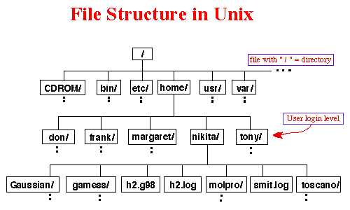

From this point on it is highly recommended that you follow along by typing everything in your terminal. Learning by doing is the best way!  

# Navigation
So let's explore how we move around our file system. This is important as many commands require you to reference the file system location when executing them.

## Where in the heck am I?
There are times we find ourself in a situation where we need to know where exactly we are in the file system. For that, we use the command `pwd`, which stands for Print Working Directory. A lot of commands are abbreviations for the action they actually do. This makes it easier on us to remember and do our jobs. If we type `pwd` in our terminals and press Enter, the terminal will print out the path to the directory we're in.

```console
user@bash: pwd
/home/devin
user@bash: 
```

Also if you're wondering what a directory is, it's just another name for a folder on a computer.

## What's in here?
So now that we can see what folder we're in, we want to know what's actually in the folder. We have the `ls` command for that. `ls` is short for list, as in list out everything in this folder. Let's give it a try.

```console
user@bash: ls
bin Documents public_html
user@bash: 
```
As you can see, it lists out the contents of the current folder you're in. What if we wanted to see the contents of another directory? `ls` can also be executed using another location.

```console
user@bash: ls Documents
index.html essay.docx Pictures
user@bash: 
```
You can see when we told `ls` to use the Documents folder as the location argument it actually prints out the contents of Documents instead of the current directory we're in.

## So many options!
Earlier, we discussed how commands also have options. Let's use one of those and see what it looks like. `ls` has an option `-l` which stands for long. Instead of just printing out the contents of the folder, the `-l` option will give a more detailed description of each item. Let's see that in action.

```console
user@bash: ls
bin Documents Downloads
user@bash:
user@bash: ls -l
total 3
drwxr-xr-x  2 devin users 4096 Mar 23 13:34 bin  
drwxr-xr-x 18 devin users 4096 Feb 17 09:12 Documents  
drwxr-xr-x  2 devin users 4096 May 05 17:25 public_html  
user@bash:
user@bash:ls /etc  
a2ps.cfg aliases alsa.d cups fonts my.conf systemd  
user@bash: ls /etc  
a2ps.cfg aliases alsa.d cups fonts my.conf systemd  
...  
user@bash: ls -l /etc  
total 3  
-rwxr-xr-x  2 root root 123 Mar 23 13:34 a2ps.cfg  
-rwxr-xr-x 18 root root 78 Feb 17 09:12 aliases  
drwxr-xr-x  2 devin users 4096 May 05 17:25 alsa.d  
...  
user@bash: 
```

As we can see when printing out the long listing it tells us a lot more. Lets try to understand what some of that output means:

* If the first letter we letter we see is a "d" then it's a directory. So "drwxr-xr-x" would mean that line is printing out a folder. If we see "-" then it is a file. For example: -rwxr-xr-x
* The next 9 characters (ex: rwxr-xr-x) are permissions for the file or directory
* The next field is the number of blocks (don't worry too much about this).
* The next field is the owner of the file or directory (devin in this case).
* The next field is the group the file or directory belongs to (users in this case).
* Following this is the file size.
* Next up is the file modification time.
* Finally we have the actual name of the file or directory.

## What is a path?
I think it's time we jumped more into paths and what they are. When referring to a file or directory in a the terminal we are referring to a path. So for example the path to my Documents directory would be `/home/devin/Documents`. A path is literally just a way to get to a file or directory in your computer system.  

First though, for you to understand the concept of paths you need to understand how your computer's file system is structured. The Unix filesystem is essentially a giant tree. Here's a picture to illustrate my point.
  
The first level is your root directory and is located at `/`. The root fodler has child folders and those have child folders and so on. If you see `/home` has child directories that go to the different users on your system. Then those user directories have that users folders such as `/home/nikita/games`.  

### Which path to take?
So there are 2 kinds of paths. Absolute paths and relative paths.  

Absolute paths refer to a location starting from the root. For example: `/home/nikita/games`.  

Relative paths refer to location in relation to what directory you're in. For example using the picture above if I was in the `/home` directory and wanted to point to the `/home/nikita/games` directory than I could just say `nikita/games` because it's relative to where I am currently. Notice I also don't start with a slash because if I did then the terminal would think I'm trying to start from the root directory. 

#### Quick things to note

* ~ (tilde) - This is a shortcut for your home directory. eg, if your home directory is /home/ryan then you could refer to the directory Documents with the path /home/ryan/Documents or ~/Documents
* . (dot) - This is a reference to your current directory. eg in the example above we referred to Documents on line 4 with a relative path. It could also be written as ./Documents (Normally this extra bit is not required but in later sections we will see where it comes in handy).
* .. (dotdot)- This is a reference to the parent directory. You can use this several times in a path to keep going up the hierarchy. eg if you were in the path /home/ryan you could run the command ls ../../ and this would do a listing of the root directory.  

## Time to make a move
So you're probably thinking "yea that's cool that I can list all these directories and files but how do I actually move around in my directories. We have `cd`, short for Change Directory, for that. For example:

```console
user@bash: pwd
/home/devin
user@bash: ls
Documents
user@bash: cd Documents
user@bash: ls
file1.txt file2.txt file3.txt Games
user@bash: ls Games
Shooters Action RPG
user@bash: cd Games/Shooters/
user@bash: ls
GuyWithABigGun.dmg
user@bash: cd ../../
user@bash: pwd
/home/devin/Documents
```

#### Be lazy!!
Programmers are always thinking of new ways to spend less time doing the boring stuff. With tab completion you can have the computer spell things out for you instead of typing it. For example:  
```console
user@bash: pwd
/home/devin
user@bash: ls
Documents Downloads Pictures docker.html
user@bash: Do
```

Now at this point in my typing "Do" the terminal is aware that there are two locations I could possibly be thinking of: Downloads and Documents. You're probably thinking "why not docker.html too?". Well that's because the terminal is aware of casing. That being said if I press the tab key once nothing will happen because there are still multiple options. If I press it twice it will print out the available options though.

```console
user@bash: Do
Documents Downloads
user@bash: Doc
```

Now that I've typed "Doc" and there is only one available option left I can hit the the tab key and the terminal autocomplete "Documents" for me.


TRANSITION GOES HERE